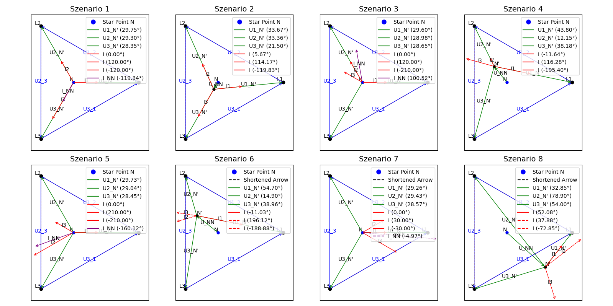

# Sternnetzwerke Graphing

Ein Python-Projekt zur Visualisierung von Sternnetzwerken (Sternschaltung) und deren Berechnungen mithilfe von Zeigerdiagrammen. Es ermöglicht die Eingabe von Daten aus einer Excel-Datei, das Zeichnen von Diagrammen und die Berechnung von Sternpunktverschiebungen und weiteren relevanten elektrischen Parametern.

## 📋 Inhaltsverzeichnis

1. [Installation](#installation)
2. [Verwendung](#verwendung)
3. [Features](#features)
4. [Abhängigkeiten](#abhaengigkeiten)
5. [Beispiel](#beispiel)
6. [Mitwirken](#mitwirken)
7. [Lizenz](#lizenz)

## ⚙️ Installation

Um das Projekt lokal zu verwenden, stelle sicher, dass Python 3.x installiert ist, und führe dann die folgenden Schritte aus:

1. Klone das Repository:

   ```bash
   git clone https://github.com/DerPfandadler/sternnetzwerke_graphing.git
   cd sternnetzwerke_graphing
   ```

2. Erstelle ein virtuelles Umfeld (optional, aber empfohlen):

   ```bash
   python -m venv venv
   source venv/bin/activate  # Auf Windows: venv\Scripts\activate
   ```

3. Installiere die erforderlichen Abhängigkeiten:

   ```bash
   pip install -r requirements.txt
   ```

## 🛠️ Verwendung

1. **Daten vorbereiten:**
   
   Das Projekt benötigt eine Excel-Datei, um die Daten für Ströme, Spannungen und Winkel zu laden. Die Datei sollte die folgenden Tabellen enthalten:
   
   - `currents`: Liste der Ströme für jedes Szenario.
   - `angles`: Winkel der Ströme.
   - `inn_values`: Wert des Sternpunktstroms (I_NN) für jedes Szenario.
   - `unn_values`: Spannungswerte für jedes Szenario.
   - `voltages`: Spannungen.

   Es gibt eine [Beispieltabelle](data/input.xlsx).

2. **Skript ausführen:** 

   Führe das Hauptskript aus, um mit der Visualisierung zu starten:

   ```bash
   python __init__.py
   #OR
   python zeigerdiagramme.py #(ohne Ausgabe der Anleitung und Überprüfung der Eingabe)
   ```

   Das Skript lädt die Excel-Daten und zeigt eine interaktive Visualisierung der Zeigerdiagramme an. Du kannst zwischen den Szenarien navigieren und die Diagramme anpassen.

   **Navigation:**  
   - Verwende die Pfeiltasten (`←` und `→`), um zwischen den Szenarien zu wechseln.
   - Drücke `q`, um das Programm zu beenden.

3. **Übersicht anzeigen:** 

   Die Übersicht mit allen Diagrammen öffnet sich automatisch wenn das erste Fenster geschlossen wurde.

## 🔧 Features

- **Zeigerdiagramme:** Visualisierung von Strömen, Spannungen und Sternpunktverschiebungen.
- **Navigation zwischen Szenarien:** Verwende die Pfeiltasten zur Navigation zwischen verschiedenen Szenarien.
- **Excel-Datenintegration:** Lade Szenariodaten direkt aus einer Excel-Datei.
- **Individuelle Diagramme:** Erstelle für jedes Szenario ein individuelles Diagramm.
- **Zusammenfassung der Szenarien:** Zeige alle Szenarien auf einmal in einem Übersichts-diagramm an.

## 📦 Abhängigkeiten

Das Projekt benötigt die folgenden Python-Bibliotheken:

- `matplotlib`: Zum Zeichnen der Diagramme.
- `numpy`: Für mathematische Berechnungen und Datenmanipulation.
- `openpyxl`: Zum Laden von Excel-Daten.
- Weitere Abhängigkeiten sind in der `requirements.txt` Datei gelistet.

Die minimalen Versionen dieser Bibliotheken werden in der Datei `requirements.txt` angegeben.

## 🖼️ Beispiel



## 🤝 Mitwirken

1. Forke das Repository.
2. Erstelle einen neuen Branch (`git checkout -b feature-xyz`).
3. Nimm Änderungen vor und committe diese (`git commit -am 'Add feature xyz'`).
4. Push deinen Branch (`git push origin feature-xyz`).
5. Erstelle einen Pull Request.

## 🚧 TODO

- Automatische Bestimmung der Phasenverschiebungen der Ströme
- CLI
- Clean up 🧹

## 📝 Lizenz

Dieses Projekt ist unter der GPLv3-Lizenz lizenziert. Siehe [LICENSE](LICENSE) für Details.
